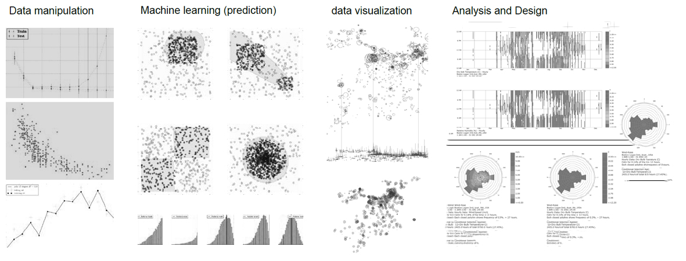

# DataScience_BPS_GSD2021
# Introduction to *Data Science* for *Building Simulation* Harvard JTerm

- Instructor: Jung Min Han, DDes 2022, Harvard GSD
 
- Date: Jan 11-15 , 2021 
 
- Time: 9:00 - 11:00 a.m.

The modeling of net zero energy buildings is an increasing concern in both the building design and sustainable consulting industries. The objectives that have been raised and recognized will change how buildings are designed, constructed, and maintained. The building design industry will soon be galvanized by regulations and standards designed to encourage net zero energy buildings while still providing comfortable built environments. Early adoption of performance simulation software in the design decision-making process is imperative to realizing such goals. Passive building design can be achieved in the early design stage. Guiding designers to pursue sustainability in built environments will bring favorable outcomes and require only low-cost changes. 
Machine learning and data science are promising approaches to shaping the design process, offering instant performance feedback. This class introduces several methods of environmental analysis and a number of building performance simulation tools, including daylighting, airflow, and energy. The required programming skills and analysis techniques are incorporated by importing generic weather information to predict energy use in response to design changes. This course also introduces data management skills including Python scripting, machine learning, and 3D data visualization. 
The course consists of five days of lectures and workshops covering various building simulation and data science topics. We will determine course objectives and topics of concentration at the first meeting, based on individual interests.

#### Day 1 
•	Lecture: Introduction to building performance simulation and data science
•	Workshop: Installation of the Python and ML packages and weather data manipulation
•	Tools: Anaconda, Python, Jupyter notebook

#### Day 2
•	Lecture: Daylighting simulation and data processing 
•	Workshop: Data processing (imputing missing values, cleaning data)
•	Tools: Anaconda, Python, Jupyter notebook, DIVA, Rhino, and Grasshopper

#### Day 3
•	Lecture: Energy simulation and parametric study
•	Workshop:  Parametric simulation and optimization using Rhino and Grasshopper 
•	Tools: ArchSim, GH-Python, Rhino, and Grasshopper

#### Day 4 
•	Lecture: Airflow simulation and visualization
•	Workshop: Data visualization: 2D (energy) and 3D (airflow)
•	Tools: Python, Jupyter notebook, Butterfly, Rhino, and Grasshopper

#### Day 5
•	Lecture: Machine learning and advanced simulation techniques
•	Workshop: Introduction to ML using simulated data
•	Tools: Python, Sk-Learn, and Jupyter notebook

